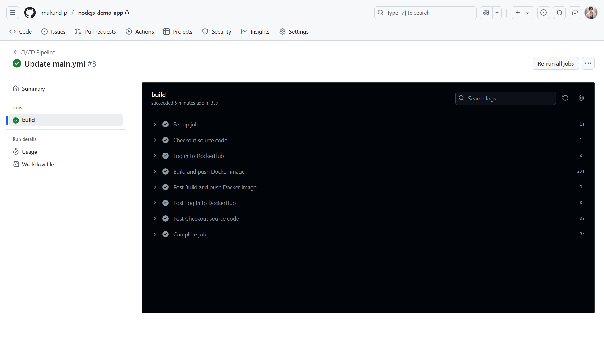
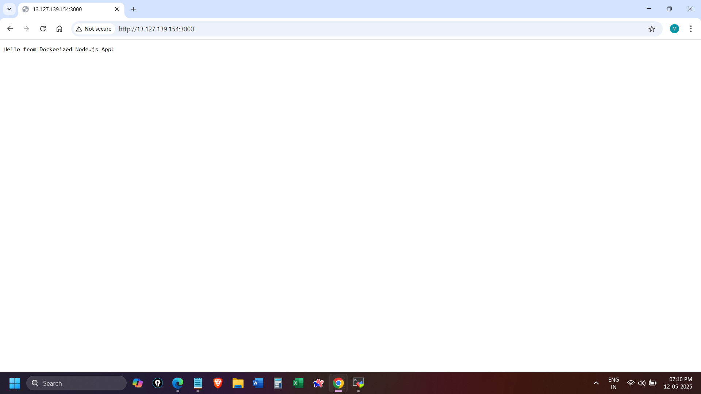
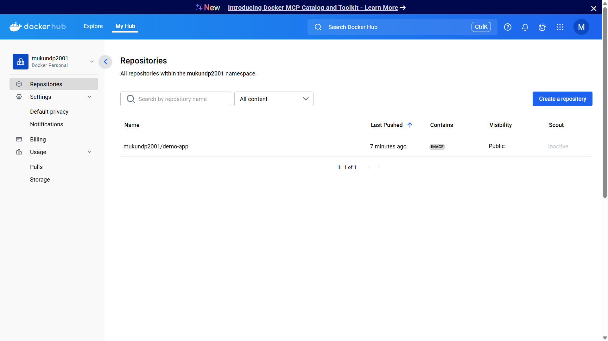
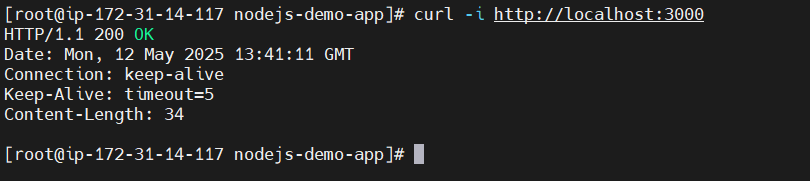

# 🚀 Node.js CI/CD Pipeline using GitHub Actions and Docker

This project demonstrates a CI/CD pipeline to automatically build, test, push, and deploy a Dockerized Node.js application using:

- **Node.js** – simple HTTP server
- **GitHub Actions** – for CI/CD automation
- **Docker & DockerHub** – for containerization and registry
- **Amazon EC2 (localhost)** – for deployment

---

## 📁 Folder Structure

nodejs-demo-app/ <br>
├── .github/ <br>
│   └── workflows/ <br>
│       └── main.yml <br>
├── screenshots/ <br>
│  ├── github-actions-success.png <br>
│  ├── browser-response.png <br>
│  ├── dockerhub-image.png <br>
│  └── curl-response.png <br>
├── Dockerfile <br>
├── index.js <br>
├── package.json <br>

---

## ⚙️ CI/CD Pipeline Flow

1. Push code to **`main`** branch.
2. GitHub Actions builds and pushes Docker image to DockerHub.
3. EC2 instance pulls the image and deploys the app via Docker.

---

## 🖼 Screenshots

### ✅ 1. GitHub Actions Workflow – Success ###
This shows a successful CI/CD run triggered by a push to the **`main`** branch.



---

### ✅ 2. App Output – Via Browser
This confirms the app is running successfully on Browser at port **3000**.



---

### 📦 3. DockerHub – Image Successfully Pushed
The Docker image is available on **DockerHub** after CI/CD completion.



---

### 🌐 4. App Output – Via Curl
This confirms the app is running successfully on EC2 at port **3000**.



---


## Test Locally
```bash
docker build -t mukundp2001/demo-app:latest .
docker run -p 3000:3000 mukundp2001/demo-app:latest
curl http://localhost:3000
```

## 🌐 Live on EC2
**Access via**: `http://<your-ec2-public-ip>:3000`
